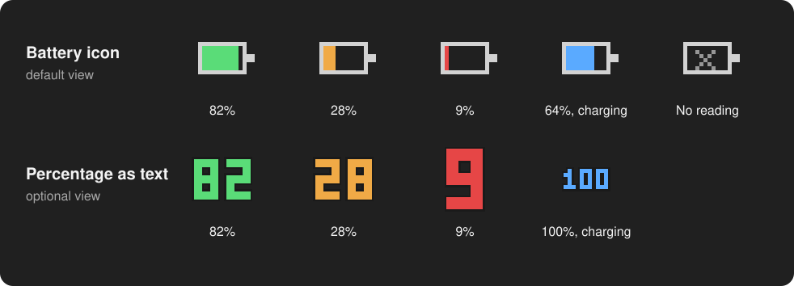

# Using the tray

razertray shows one device in the tray icon: the **selected device**. The menu
shows all connected devices.

## The icon

The battery fills from left to right. Its color shows the level of the selected
device:

| Color | Level |
|---|---|
| Green | More than 35% |
| Orange | 35% or less |
| Red | 15% or less |
| Blue | Charging, at any level |
| Gray **x** | No reading yet, or no supported device connected |

Some mice cannot report if they are charging, for example models that use AA
batteries. Their icon never turns blue. See
[Supported devices](supported-devices.md#charging-status).

These color levels are fixed. The level for
[low-battery notifications](notifications.md) is a separate setting.

Hover over the icon to see the device name and the exact percentage, for example
`Razer Viper Ultimate Wireless: 76% (charging)`.

## The menu

Right-click the icon to open the menu.

| Item | What it does |
|---|---|
| Status line | Shows the selected device and its level, or `No supported Razer devices`. You cannot select it. |
| **Select Device** | Lists every connected Razer device with its name, product ID, level and charging state. Select a device to show it in the icon. The check mark shows the selected device. |
| **Refresh now** | Reads the battery now instead of at the next check. |
| **Show percentage as text** | Shows the level as colored digits instead of the battery. Select it again to go back to the battery. |
| **Start at login** | Starts razertray each time you sign in to Windows. See [Installation](installation.md#start-at-login). |
| **Exit** | Closes razertray and removes the icon. |

razertray saves your choices for **Select Device**, **Show percentage as text**
and **Start at login** in [`config.toml`](configuration.md) right away.

## How often razertray checks

- While a device answers, razertray reads the battery once a minute. To change
  this, see `poll_interval_seconds` in [Configuration](configuration.md).
- While no device answers, razertray tries again sooner: after 2 seconds, then
  4, 8, 16 and so on, up to the normal interval. A mouse that wakes up or gets
  connected appears quickly.
- A wireless mouse that sleeps can miss a check. razertray keeps the last reading
  through two empty checks in a row. After the third, the icon shows the gray
  **x**.

## Several devices

When razertray finds more than one device, the icon shows the device that you
selected in **Select Device**. If that device is not connected, razertray
selects the first device in the list instead. The list is sorted by name.

If no device answers for three checks in a row, razertray forgets the selection.
When devices return, it selects the first one again. In that case, select your
device again in **Select Device**.
